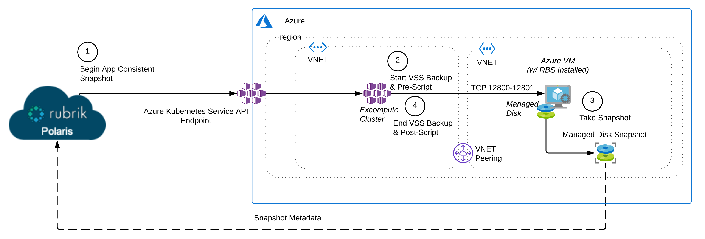
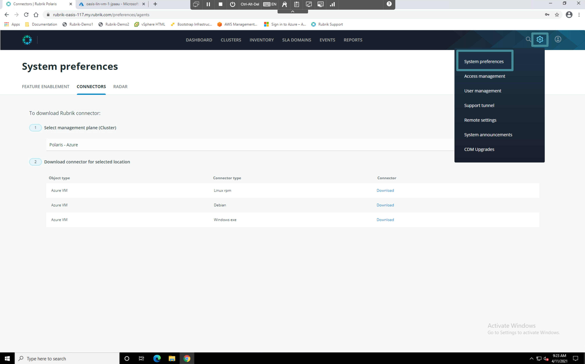
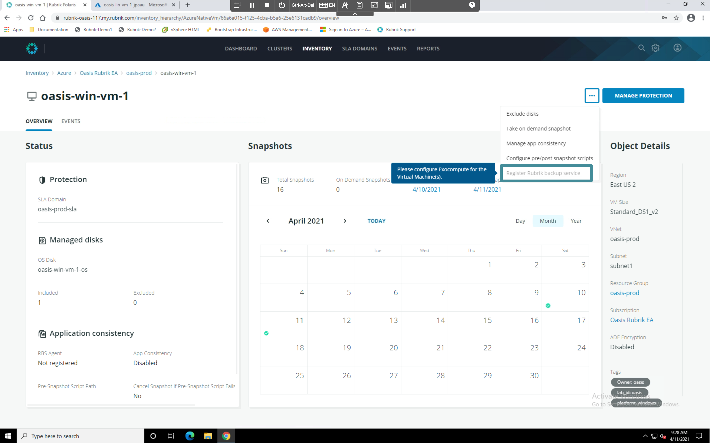
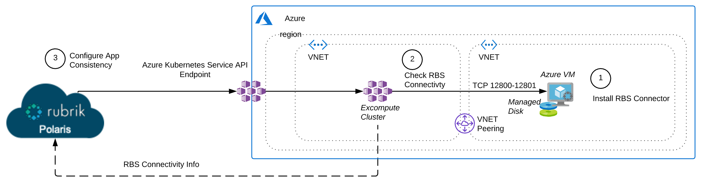
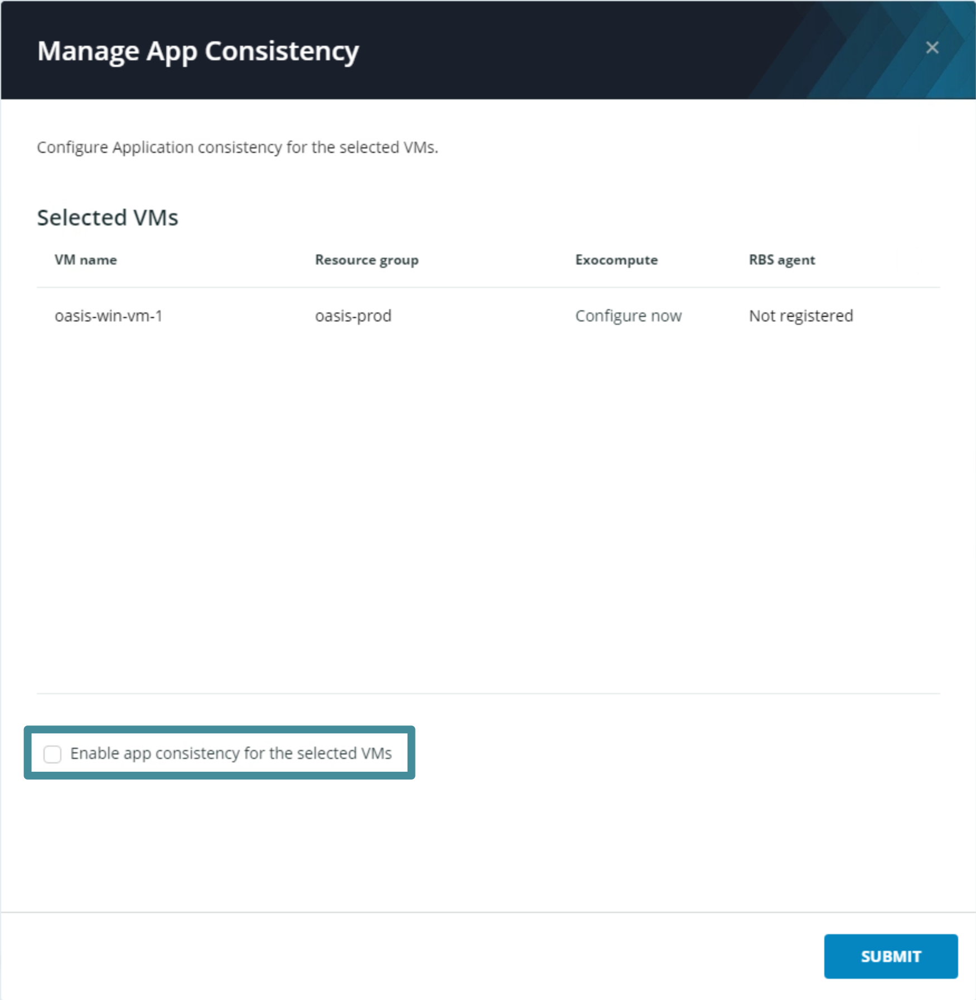
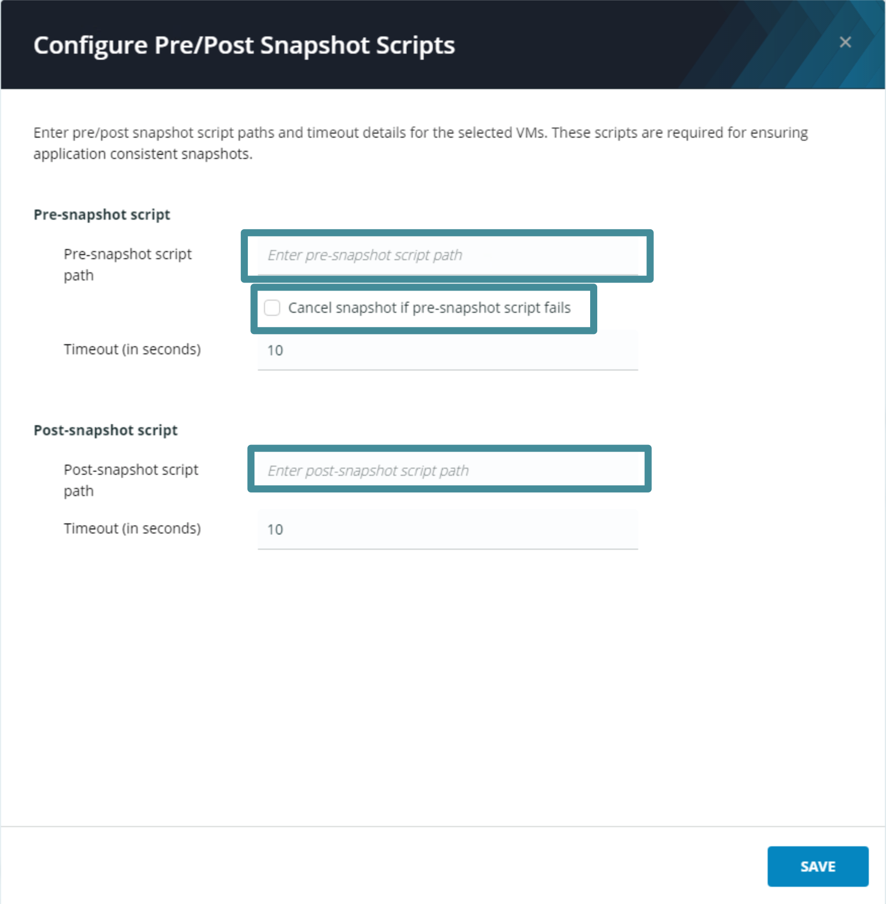

# App Consistent Snapshots

The Rubrik Backup Service (RBS) provides the the in OS connectivity required to take app consistent VM snaphots. Rubrik's exocompute framework is used to provide connectivity back to Rubrik Polaris in this scenario, as it would be undesireable to have RBS in each VM communicating directly with Polaris. Exocompute extends Polaris to support an on demand “bring-your-own-compute” approach to protecting Azure VMs and managed disks. The diagram below depicts the process.

The Rubrik Backup Service software can be downloaded directly from Polaris, or the software can be downloaded once and copied to the appropriate server as needed.


**Trail Map:**

The Rubrik Backup Service software can only be used with the Polaris instance from which the software is obtained. Each Polaris instance generates a copy of the Rubrik Backup Service software that includes authentication and encryption information specific to that Polaris deployment. This method ensures that Polaris and the Rubrik Backup Service can reliably authenticate each other and encrypt data-in-flight.


As necessary, Polaris automatically upgrades the Rubrik Backup Service software on all protected hosts. Upgrades do NOT require a reboot or a server restart.

The Rubrik Backup Service must run as an account that is a member of the Administrators group of the Windows Server host. On Linux or Unix machines you will need to install with root level access.

Let's explore the configuration process for app consistency.

## Configuring App Consistency

Click the **Gear Icon** and select **System Preferences**. The system preferences menu appears. Observe the various versions of RBS that can be downloaded from Polaris.

 

 From the **Inventory** window, select **Azure** then select **Virtual Machines/Managed Disks**. The VM inventory appears. Click the name of the VM whose VM name matches `your_lab_id-win-vm-1`. The VM Overview page appears.

 Open the ellipsis (`...`) menu next to the **Manage Protection** button. Hover over the `Register Rubrik backup service` menu item.

 

Currently, registering RBS is not an option because Exocompute has not been configured for the subscription and region containing this VM. Assuming Exocompute were configured, clicking this menu item would run the following workflow to Register RBS on the selected VM.

 

Assuming RBS was uccessfully registered, app consisteny and pre/post scripts can be configured using the corresponding menu items in the ellipsis (`...`) menu. Open the menu and select **Manage app consistency**. The Manage App Consistency window appears.

 

Checking the `Enable app consistency for the selected VMs` box would cause RBS to quiesce the guest OS and it's applications via VSS each time Cloud Native Protection for Azure takes a snapshot. **Do not enable app consistency at this time** instead, click the `X` in the top right corner of the Manage App Cosistency window.

Open the ellipsis (`...`) menu again and select **Configure pre/post snapshotscripts**. The Configure Pre/Post Snapshot Scripts window appears.

 

Here the user can enter the path to shell scripts or batch files that will be run before and after snapshot creation for this VM. There is also an option to fail the snapshot job if the Pre-script fails. **Do not enable app consistency at this time** instead, click the `X` in the top right corner of the Configure Pre/Post Snapshot Scripts window.