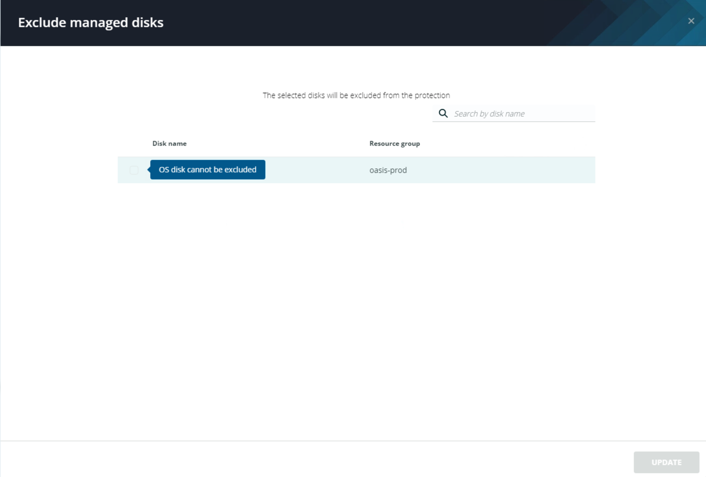

# Disk Exclusion

Disk Exclusion allows the user to exclude data volumes from the backups Polaris creates when protecting Azure VMs. Once enabled for a specific volume, future snapshote of that VM will not contain the excluded volume unless the exclusion is removed.


**Trail Map:**

Disk exclusion can prevent customers from incurring unnecessary costs when protecting certain types of VMs. As an example, imagine an application deployed to a VM that is backed up indepent of the VM itself. You still want to protect the application server, but capturing the data volumes housing the application data itself would be a waste of resources. Disk Exclusion allows you to achieve your objective in this scenario.


## Configuring Disk Exclusion

Open the ellipsis (`...`) menu next to the **Manage Protection** button. Select the `Exclude Disks` menu item. The Exclude managed disks window appears.

Here you can select managed disks to be excluded from any snapshotes created for this VM. If you hover over the **OS Disk** on this VM you will see that OS Disks cannot be excluded from VM level backups, only Data Disks can be excluded. 

Click the `X` in the top right corner of the Exclude managed disks window to close it.