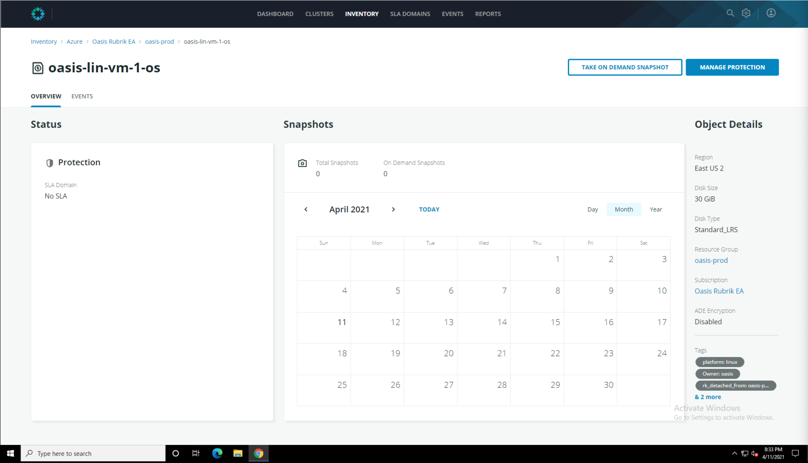
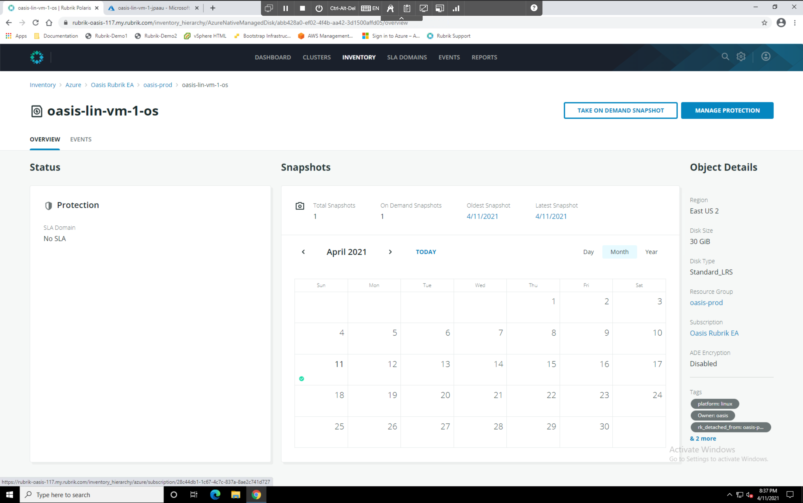

# Managed Disk Protection

On the navigation bar at the top of the window, click **Inventory** &gt; **Azure**. The Azure inventory page appears with the Virtual Machines/Managed Disks tab selected. In the **View** dropdown, select **Managed Disks**. Click the **Disk name** for the first mamnaged disk in this console. The Managed Disk overview window appears. 

 

Click the **Take on Demand Snapshot** button and confirm the action. Monitor the events stream until the snapshot is complete.

 

Once complete, open the export dialogue box to review the available export parameters for Managed Disk snapshots, then close the window.

Delete the On demand managed disk snapshot. You have now completed the Exploration badge!