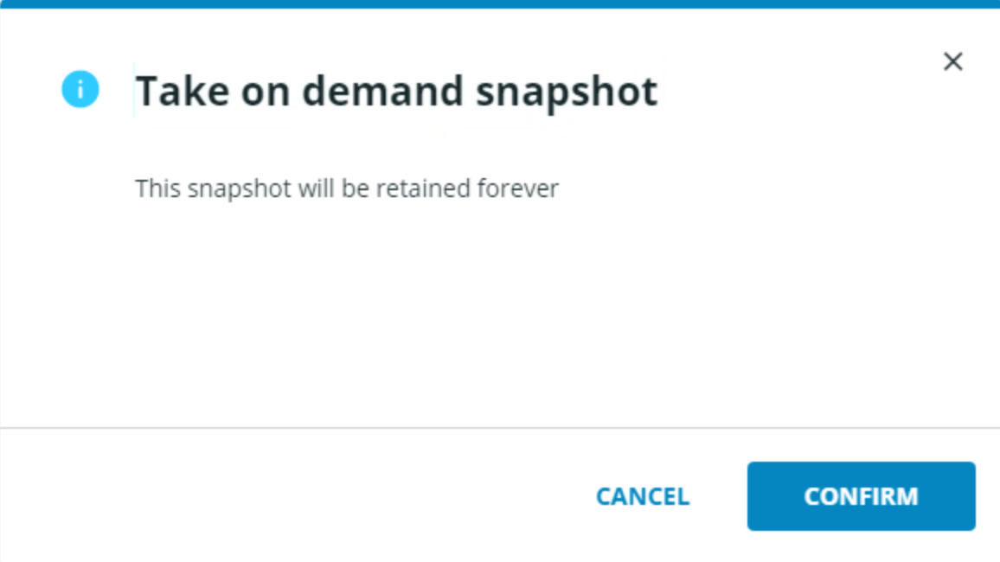
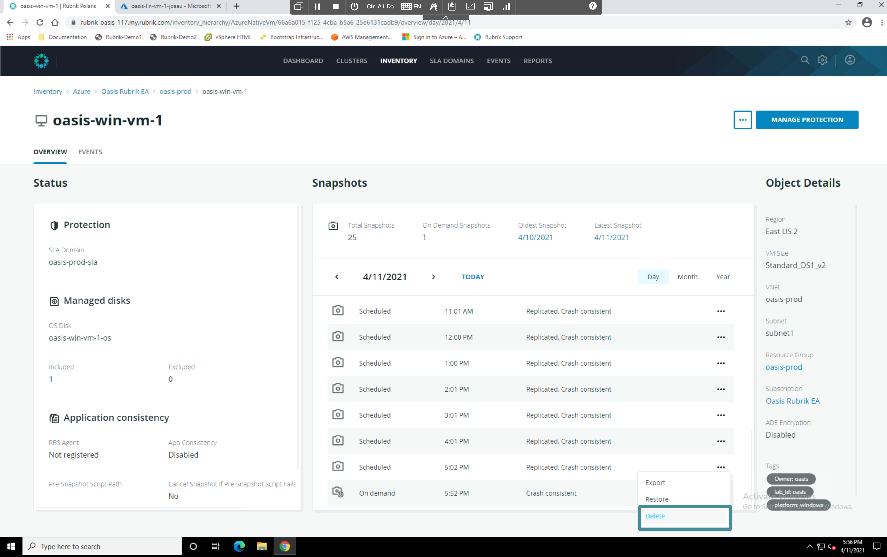
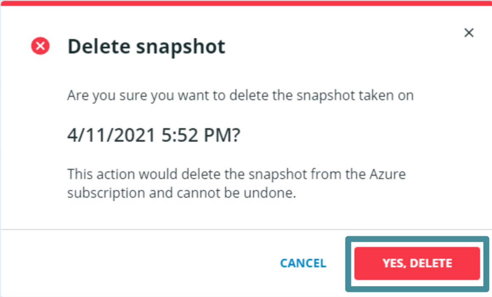

# On Demand Snapshots

On Demand snapshots allow a user to create a snapshot at any point in time that is then retained until the customer explicitly deletes it. These snapshots can be useful for attaining a last known good backup prior to performing maintenance or upgrades on VMs or applictions. 

## Create an On Demand Snapshot

Open the ellipsis (`...`) menu next to the **Manage Protection** button. Select the **Take On demand Snapshot** menu item. The Take on demand snapshot window appears.

 

Click **Confirm** to create an on demand snapshot. Once the on-demand snapshot completes (you can check the events log for this vm to confirm) click into today's date on the calendar view and open the ellipsis (`...`) menu next to the most recent On Demand snapshot. Here you can see unlike scheduled snapshots, on demand snapshots can be deleted.

 

Select the **Delete** menu item, then confirm deletion by clicking the **Yes, Delete** button.

The on demand snapshot is deleted.