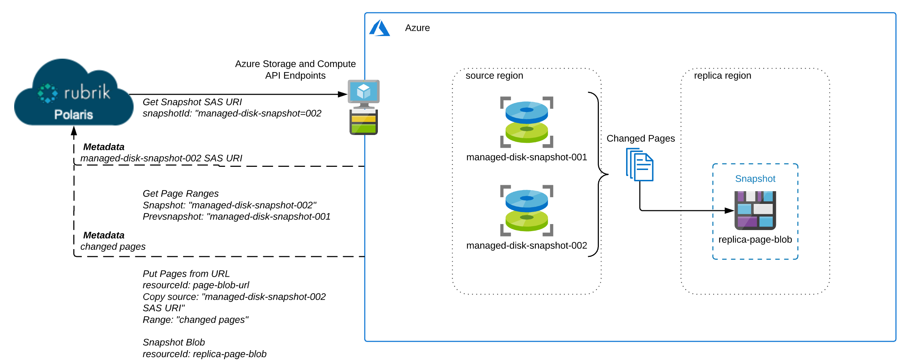
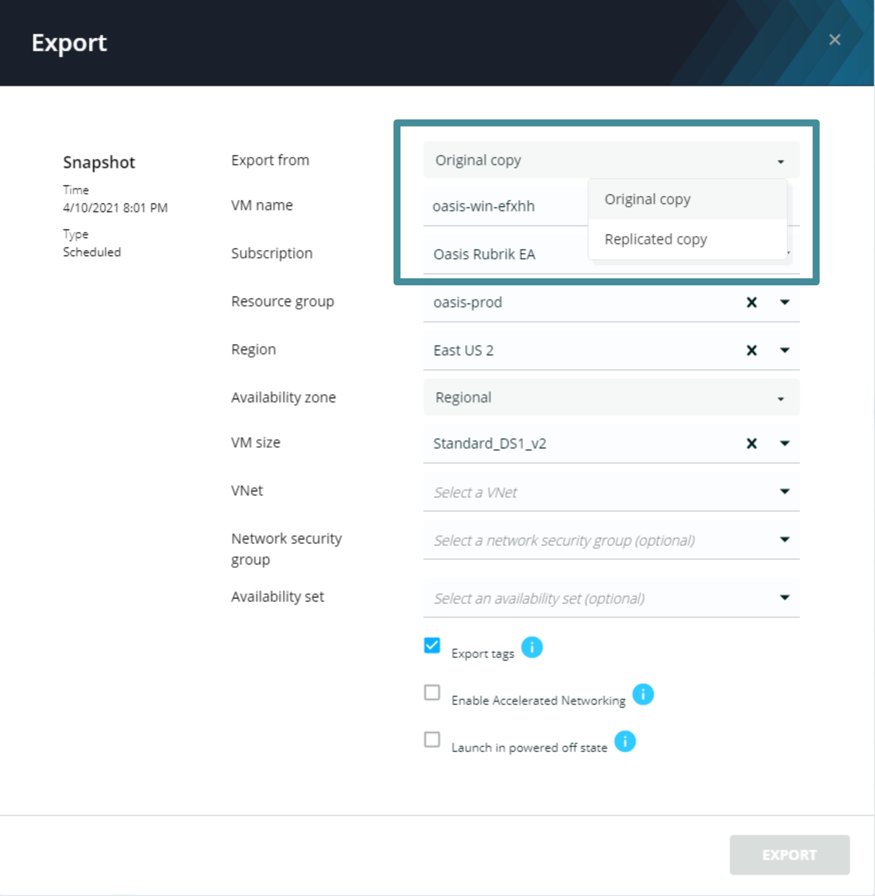

# Replication

Replication offers an easy mechanism for users to increase the resiliency of their Azure data protection strategy. When replication is configured in an SLA Domain protecting Azure VM or Managed Disk, snapshots of that object are automatically replicated to the remote region as specified in the SLA Domain. Replication is an incremental process that calculates the changed pages between the two most recent snapshots and then copies those changes to a page blob in the remote region. The diagram below depicts this process. 

 

## Explore Replication

Inspect today's Snapshots view for the vm whose name matches `your_lab_id-win-vm-1`. You should see a snapshot with a status of `replicated`. Open the export menu for this snapshot. Note that the **Export from:** parameter now offers you the choice to original snapshot (in the same region as the protected vm) or the replicated copy.

 

Click the `X` in the top right corner of the export menu to close it.


**Trail Map:**

Another feature worth highlighting here is the fact that restores can also use replicated snapshots. If for some reason the original snapshot is unavailable, Polaris will use the replicated copy to execute the restore.
