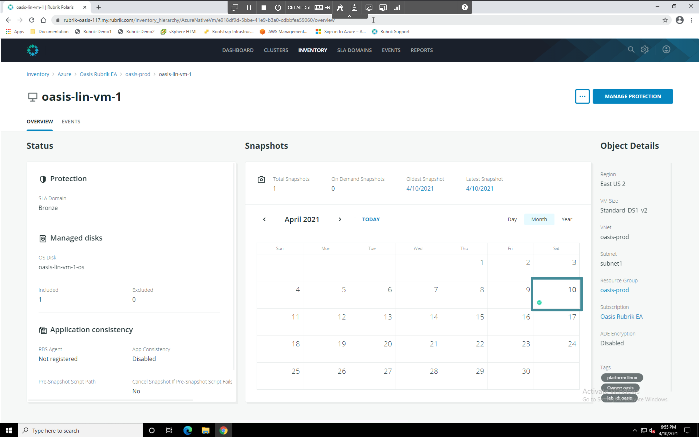
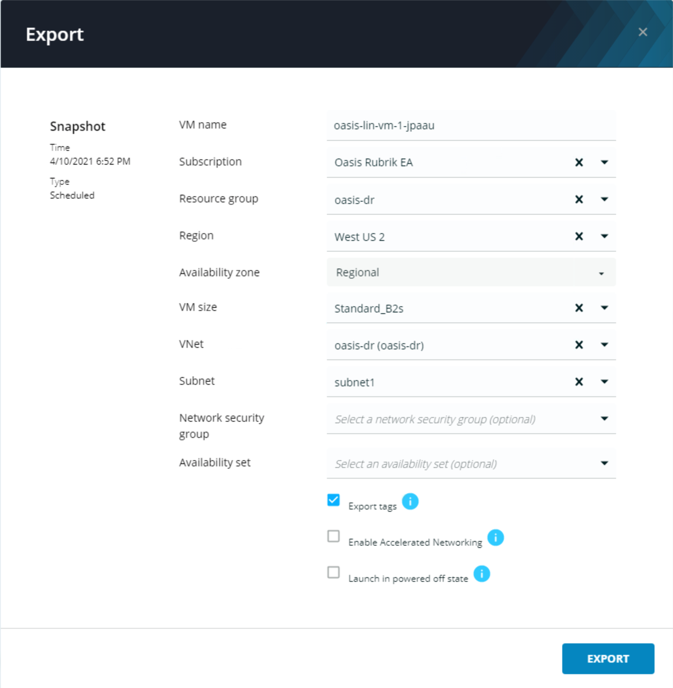

# VM Export

In your Chrome tab containing the Polaris console navigate to the **Overview** page for `your_lab_id-lin-vm-1`. Click the most recent date with a green check mark in the calendar view.

Open the ellipsis (`...`) menu for the most recent snapshot and choose **Export**. The VM Restore context menu appears.

Leave the default options as is and click **Export**. Once the VM export wizard appears enter the following parameters:

* VM name: `your_lab_id-lim-vm-1-export`
* Subscription: default
* Resource group: `your_lab_id-dr`
* Region: `West US 2`
* Availabilty zone: `Regional`
* VM size: `Standard_B2s`
* VNet: `your_lab_id-dr`
* Subnet `subnet1`
* Network security group: default
* Availbility set: default
* Export tags: ✓
* Enable Advanced Networking: ✕
* Launch in powered off state: ✕

Click **Export**

Switch back to the Microsoft Azure Resource Manger console tab in Chrome. Search for the `dr` resource group containing you lab id and navigate to it.

Here you can see the exported Azure VM, it's network adapter, and it's root volume. 

Click on the VM to view its attributes. Verify that that match the paramters supplied above.

You have now completed the Life Saving badge!