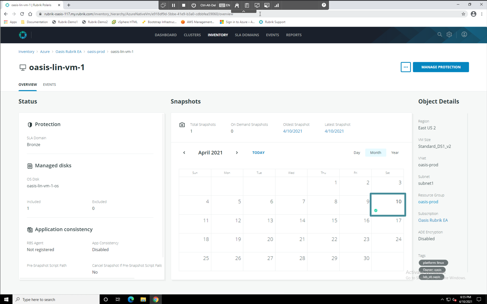
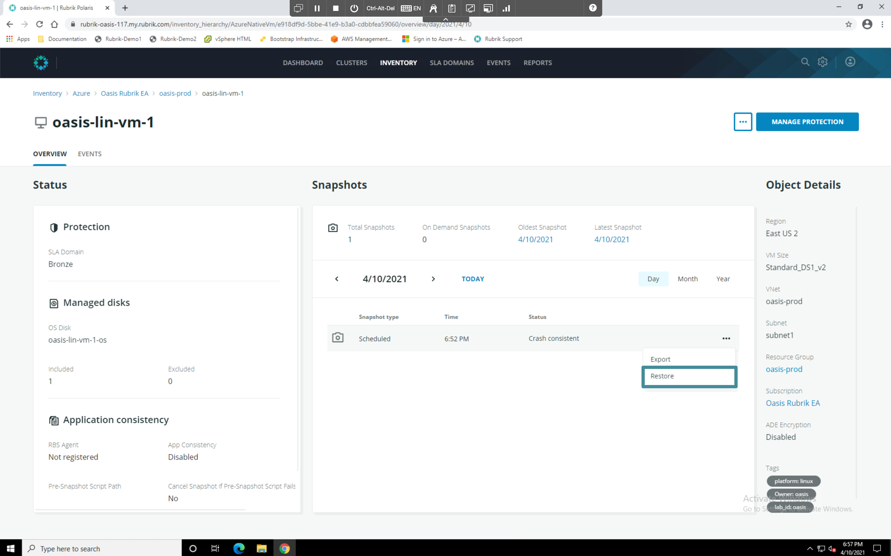
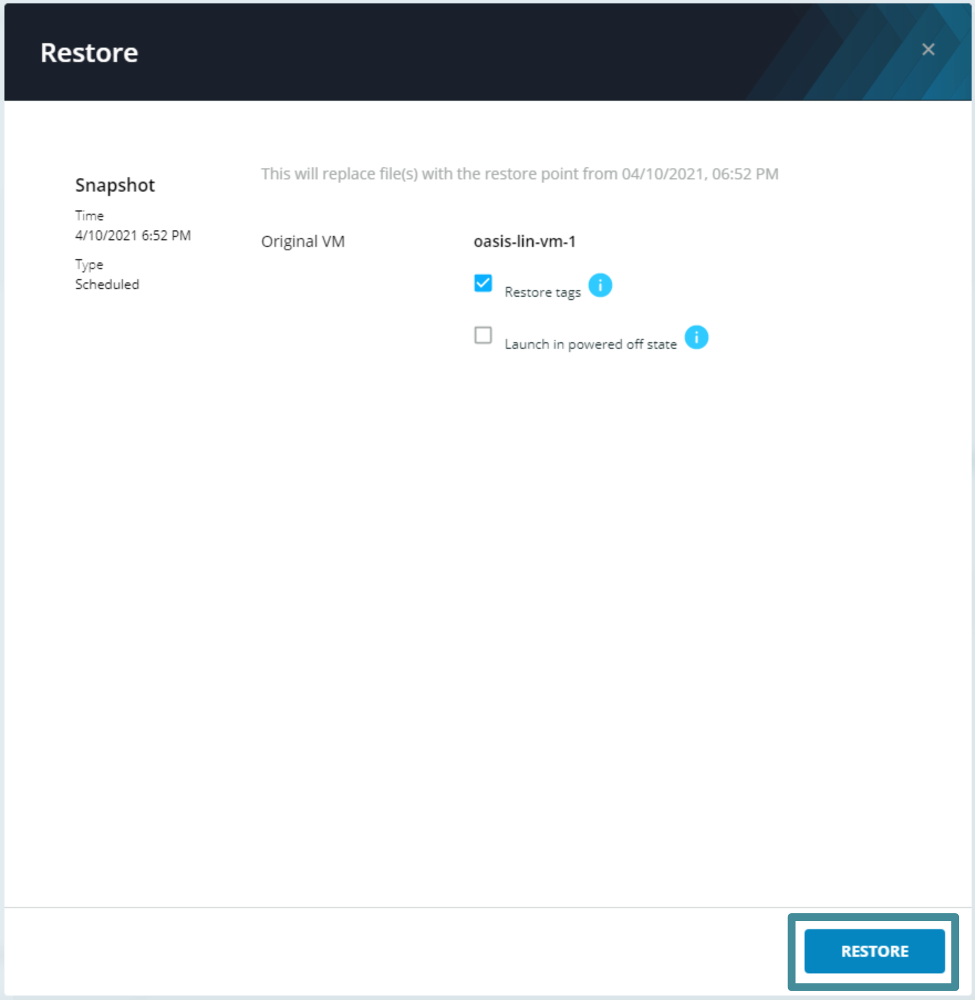
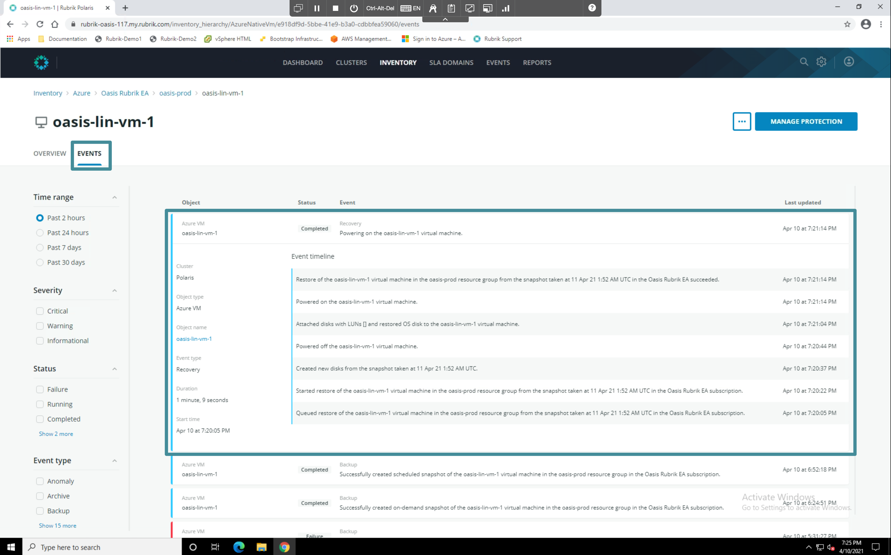
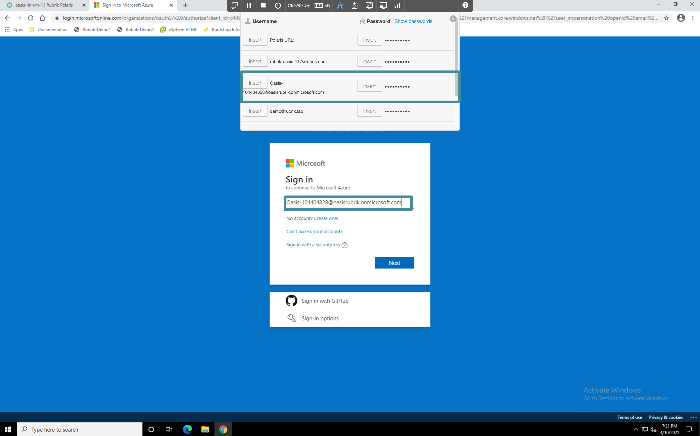
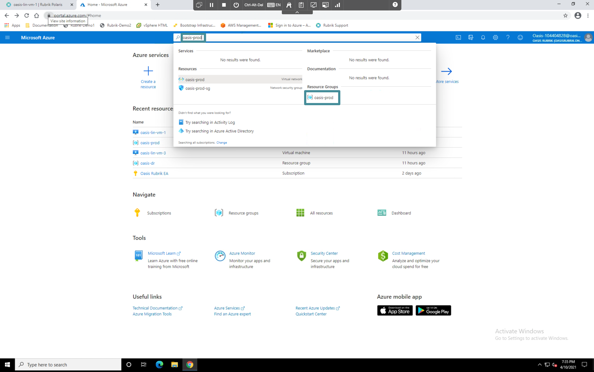
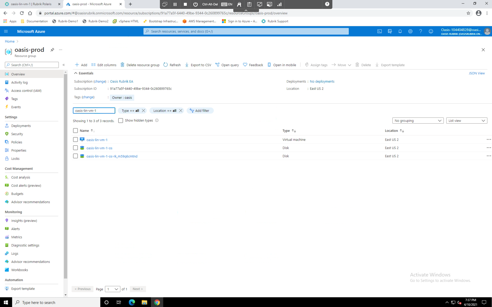
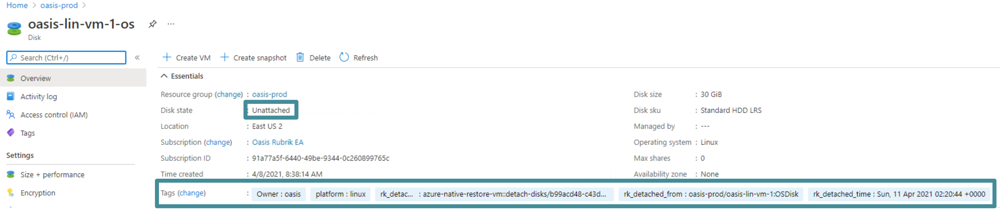
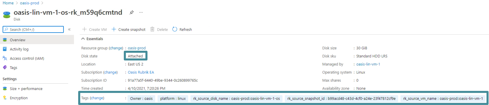

# VM Restore

Click the **VM name**, that matches `your_lab_id-lin-vm-1`. The **Overview** page for this vm appears. Click the most recent date with a green check mark in the calendar view.

Open the ellipsis (`...`) menu for the most recent snapshot and choose **Restore**. The VM Restore context menu appears.

Leave the default options as is and click **Restore**.

Click **Events**, the VM event log appears. Expand the event stream for the most recent recovery operation. Review the tasks for the recovery job. Typically these restores take place within a few minutes. 

Open a new tab is Chrome and browse to `https://portal.azure.com` Log in with the username and password in the credentials tray.

Once logged in, search for the `prod` resource group containing you lab id and navigate to it.

In the menu that appears, search for `your_lab_id-lin-vm-1`, the resource list filters down to 3 objects.

The disk named `your_lab_id-lin-vm-1-os` is the volume that was associated with the VM prior to the restore. The disk named `your_lab_id-lin-vm-1-os-RANDOM_STRING`is the volume that was used to restore the VM. Drill down into each to verify that the restored volume is currently connected to the VM and that the original is disconnected. Also take note of the restore metadata which Polaris has added to each via tags.

