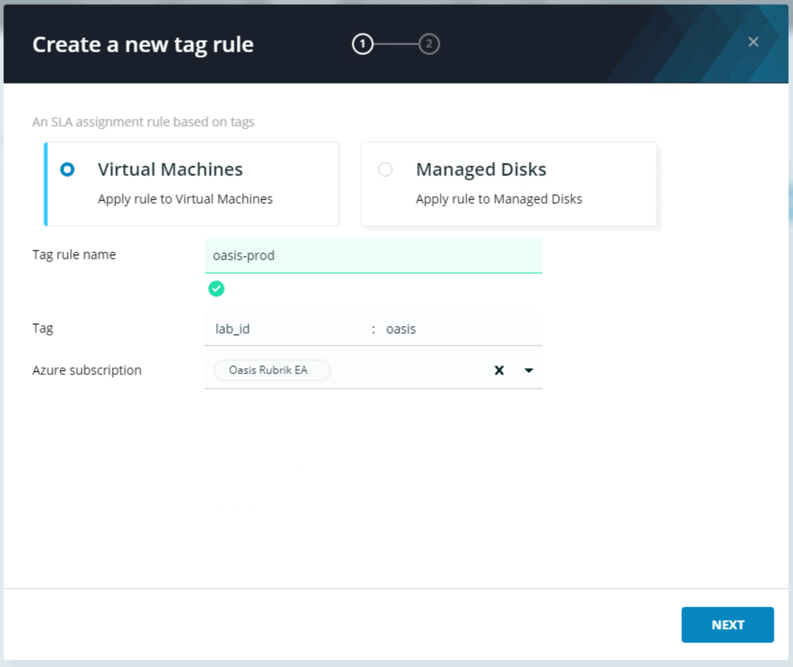
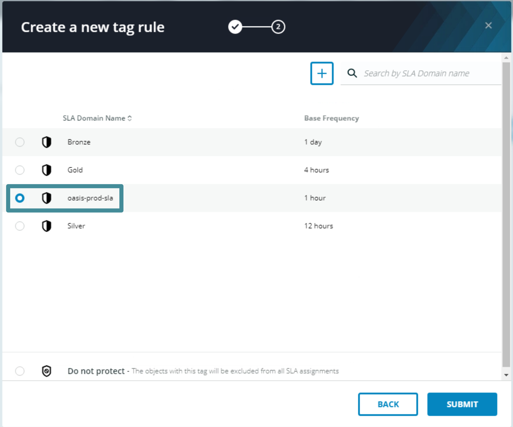

# Apply an SLA Domain

An SLA Domain may be applied at a broad level - such as the the cloud subscription, resource group, or tag. This enables newly provisioned workloads to automatically inherit protection from a higher level resource. Alternatively, an SLA Domain may be granularly applied per object to achieve specific data protection objectives.

To do so:
On the navigation bar at the top of the window, click **Inventory** &gt; **Azure**. The Azure inventory page appears with the Virtual Machines/Managed Disks tab selected.

Select **Subscriptions**. The Subscriptions inventory appears.

Select the checkbox in front of the Subscription.

Notice that the **Manage Protection** button in the upper right-hand corner of the inventory pane illuminates and is now clickable. **Do not assign an SLA Domain at this time**.

Select **Resource Groups**. The Resource Groups inventory appears.

Use the search box in the top right corner of the resource group inventory pane to search for the `prod` resource group containing your lab id. Select the checkbox in front of the Resource Group.

Notice that the **Manage Protection** button in the upper right-hand corner of the inventory pane illuminates and is now clickable. **Do not assign an SLA Domain at this time**.

Select **Tag Rules**. The tag rules inventory appears.

Click the **New Tag Rule** button. The create tag rule wizard appears. Select the **Virtual Machines** radio bubble. In the **Tag Rule Name** field, enter `your_lab_id-prod`. In the **key** field enter `lab_id`. In the **value** field enter your lab id. Select the subscrption from the **Azure Subscription** dropdown box. Review the entries for accuracy.


**Trail Map:**

Tag Rules are a powerful way to automate protection at scale. They can be applied across regions and subscriptions to streamline SLA Domain mapping. Polaris will also periodically poll your Azure subscriptions for changes and apply or update SLA Domain mappings as necessary.


Click **Next**. Select the radio bubble next to the SLA Domain you created in the last section.

Click **Submit**, this creates the tag rule.

Select **Virtual Machines/Managed Disks**. The VM inventory appears. Take note that the tag rule created in the last step has protected all but one of the VMs listed here. The direct SLA Domain assignment on `your_lab_id-lin-vm-1` was created automatically when this lab was provisioned.


**Trail Map:**

Directly assigning an SLA Domain to a Virtual Machine or Managed Disk will override Tag Rule level assignnements. Similarly, Tag Rule assignments will overite Resource Group level assignments, and Resource Group level Assignments will oveerride Subscription Level assignments. Combining all of these approaches often leads to the best user experience!


You have now completed the Orienteering badge!