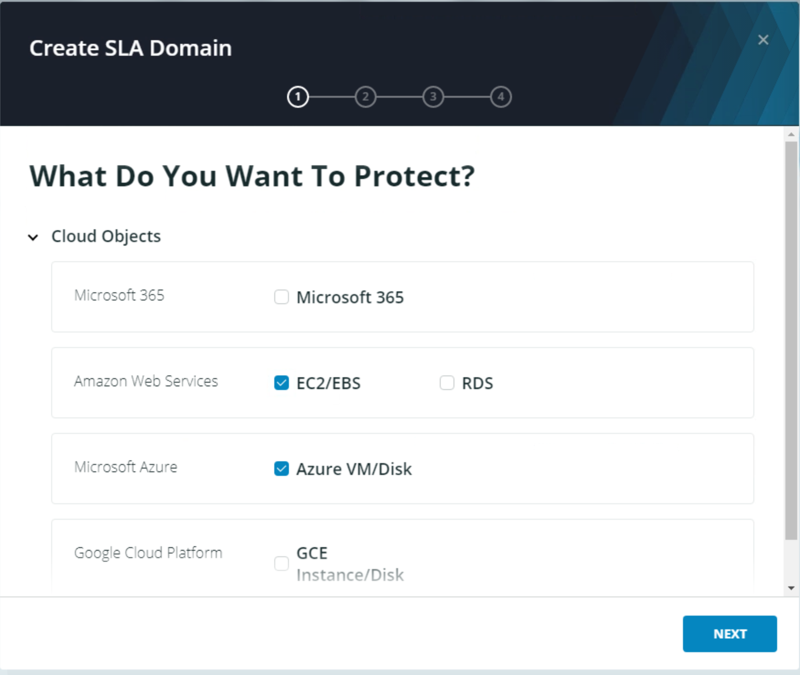
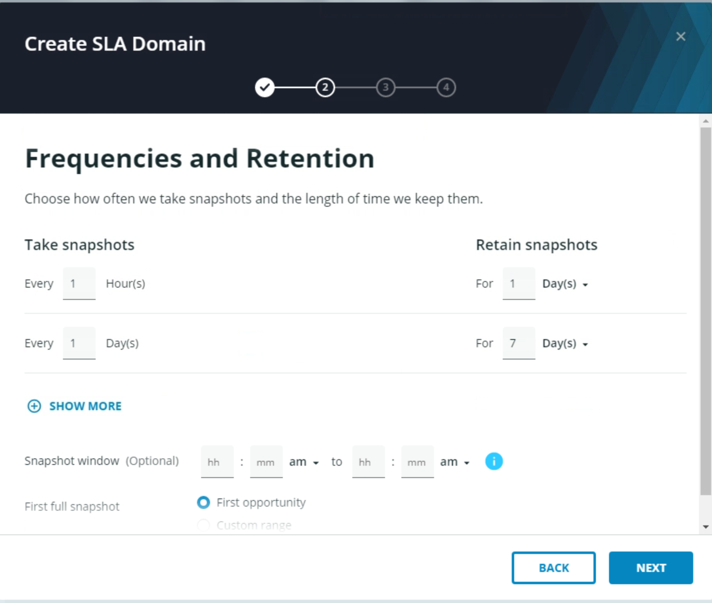
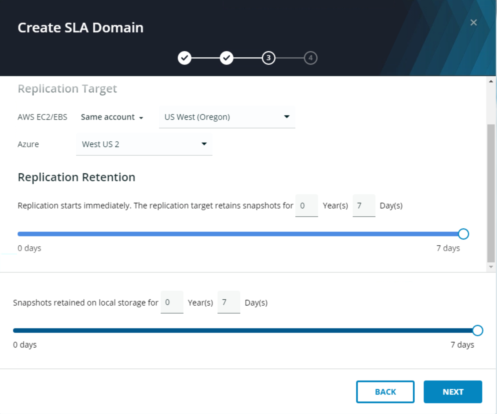
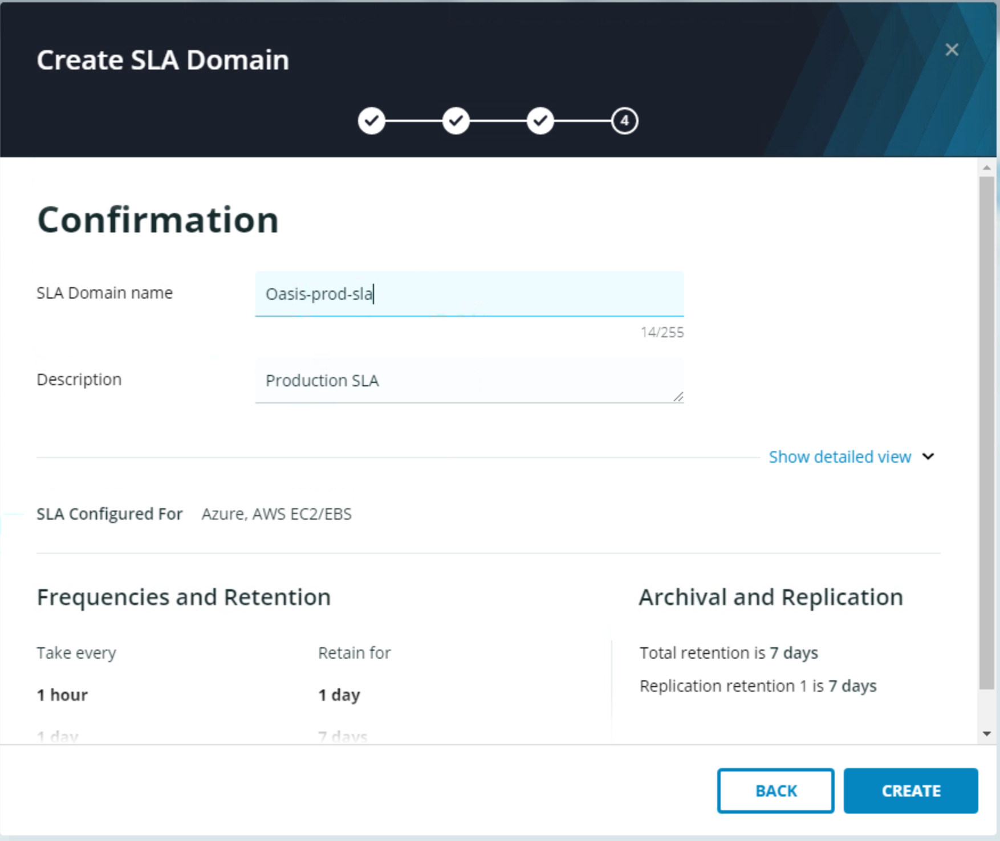

# Create an SLA Domain

To create an SLA Domain:

On the navigation bar at the top of the window, select **SLA Domains**.


**Trail Map:**

_Managed by: GPS_ - an SLA Domain that is created and managed in Rubrik Polaris.

_Managed by: Cluster_Name_ - an SLA Domain that is created and managed locally on a Rubrik Cloud Data Management (CDM) cluster.


Above the Sla Domain list, click the blue **CREATE SLA DOMAIN** button.

Create an SLA Policy using the following configuration values:

For demonstration purposes, select **EC2/EBS** and **Azure VM/Disk** then click **Next**.

Configure the SLA to take snapshots each hour for a day, and each day for a week then click **Next**.


**Trail Map:** Rubrik's Cloud Native Protection allows you to build SLA Domains that can be used across public clouds and even hybrid deployments. Use a single policy to protect your mission critical workloads and ensure they are replicated to provide increased security and resiliency.
S

Select **Next** to configure replication in the SLA Domain. 

Configure the SLA to replicate to US West (Oregon) in AWS and West US 2 in Azure.

Click **Next** and give the SLA a name that contains your lab id.

Review and then click **Create** to finish.