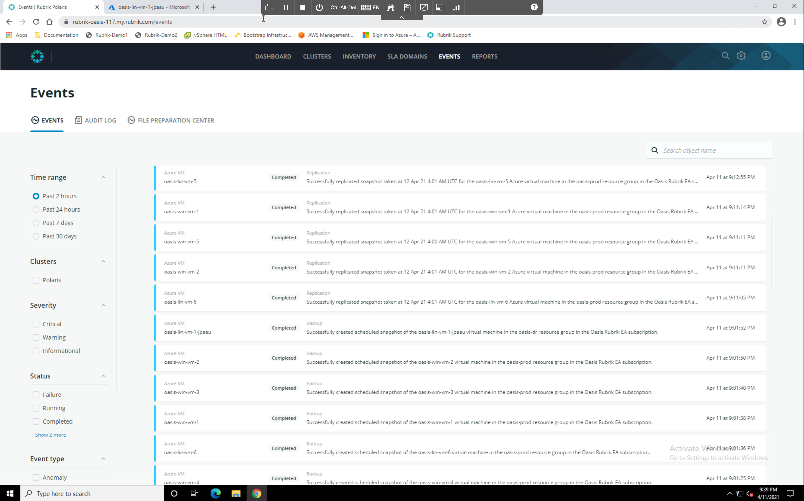
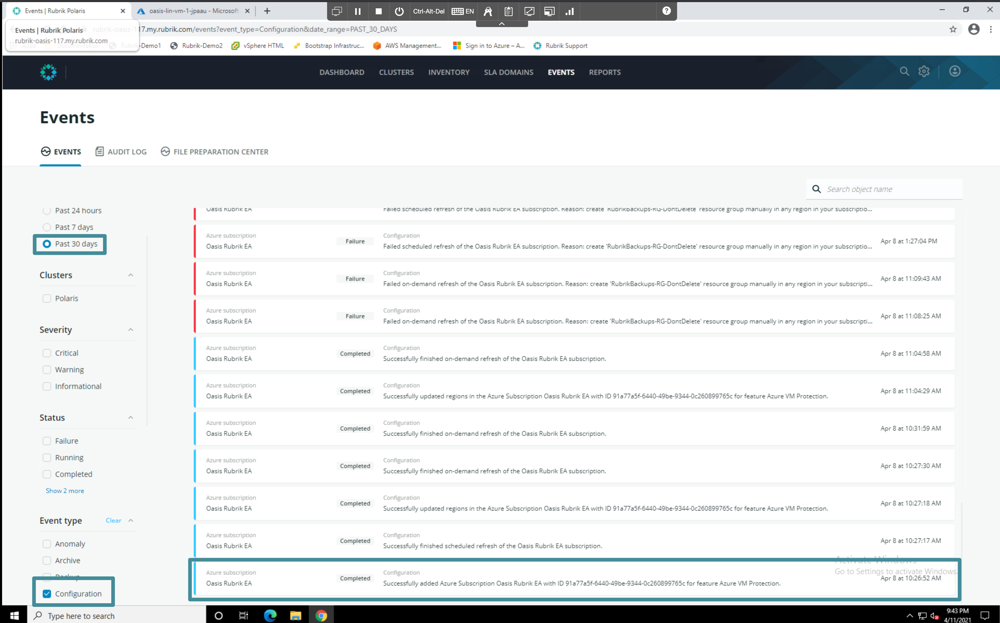
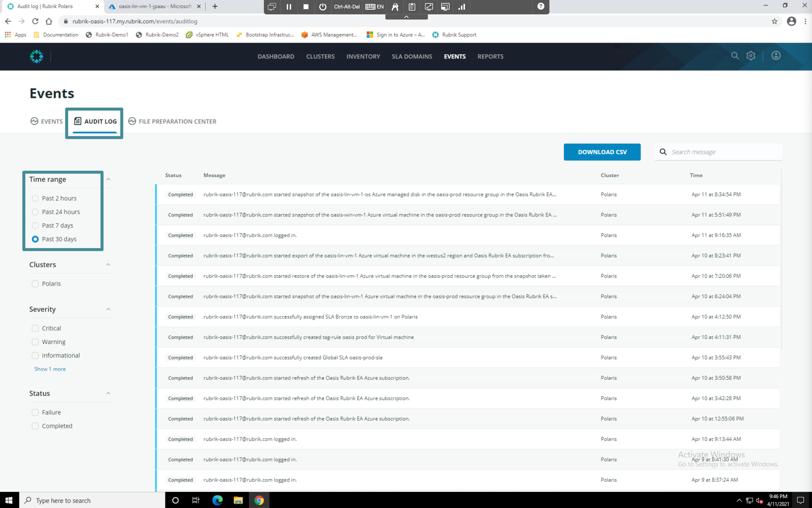

# Events

The Events log is a single source of truth for data management activities across your hybrid and multi-cloud estate. On the navigation bar at the top of the window, select **Events**. The Events log is displayed.

This log allows you to quickly find the activity you want to inspect. The Events window shows you different types of events that have occured and allows you to filter based on time, source, severity, type, and more.

Filter the events log down to display configuration events for the past 30 days. You should be able to find where the protected Azure Subscription was added to this instance of Polaris.

Select **Audit Log** from the navigation bar and expand the time range to the past 24 hours. Here you can see an audit log of the actions you took while configuring this lab environment!

