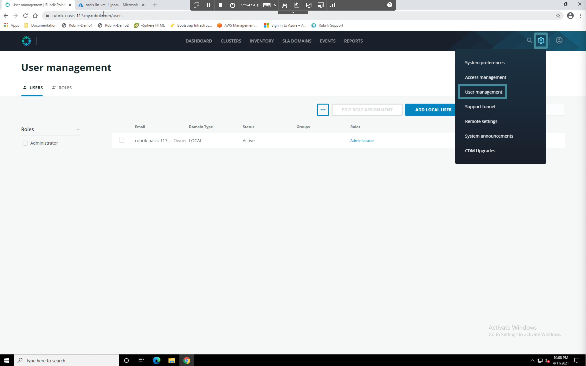
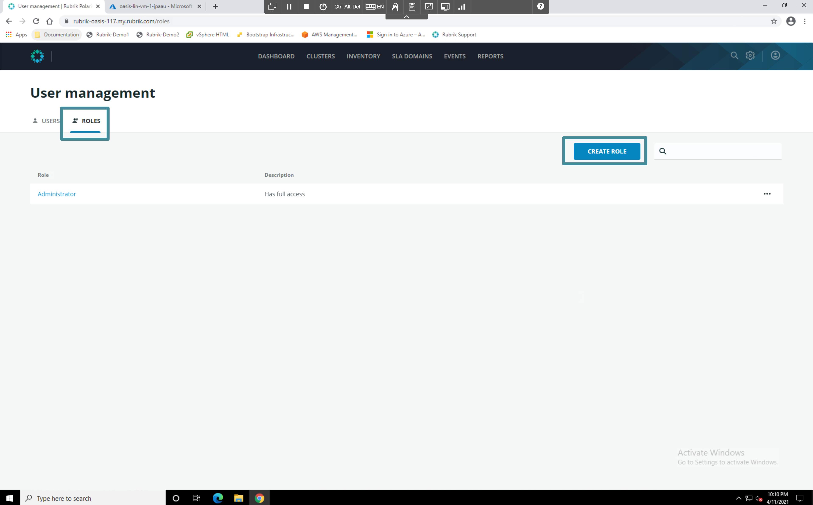

# Role Based Access Control

Cloud Native Protection on Rubrik's Polaris platform provides customers with the simplicity of Rubrik's enterprise SLA policy engine coupled with the power of multi-cloud data management. Role based access control is a critical part of keeping your data secure. Polaris offers a robust framework for Cloud Native Protection.

## Create a Custom Role

Click the **Gear Icon**. in the top right corner of the Polaris console and select **User Management**. The User Management console appears.

Select **Roles**, then click the **Create Role** button.

Select the following items in the Create role wizard: **Custom role** => **Data management** => **By object type**

The Create Data management role - by type window appears.

Select the **Azure native** radio button and use the pencil icons on the right hand side to explore the various source object, target object, and action constraints you can place on a user when protecting Azure workloads. 


**Trail Map:** 

Role based access control allows you to define custom roles for your administrators, and operators. Create roles constrained by Azure subscription and even roles restricted only to view, recovery, or protection activities. Polaris offers a single pane of glass approach to protecting data in and across clouds.
