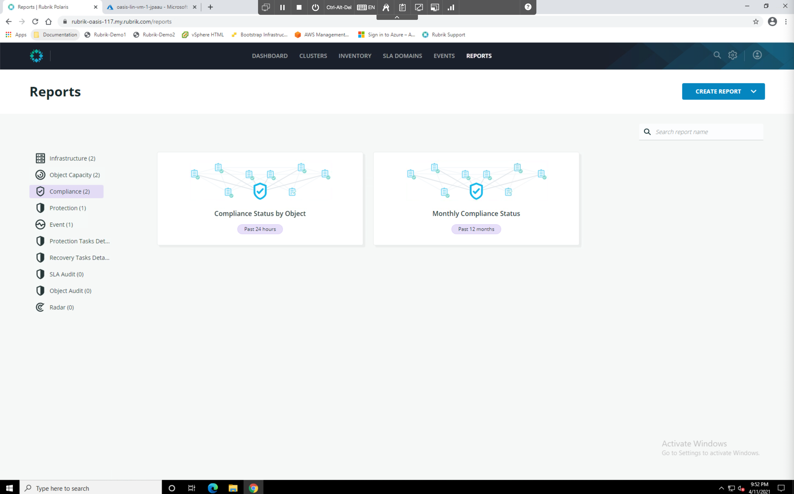
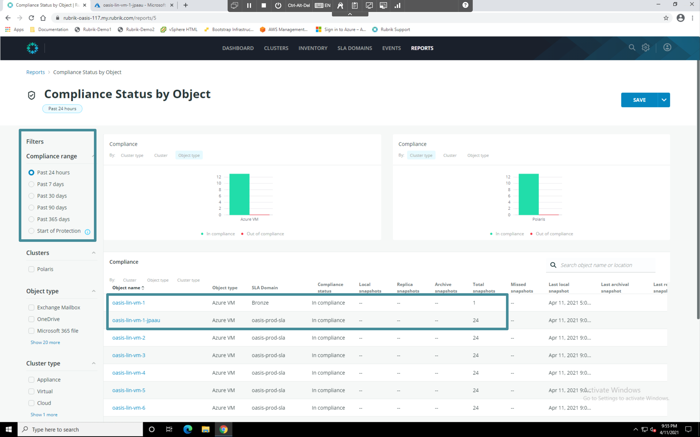

# Reporting

The Polaris reporting engine allows users to quickly generate various types of reports regading data management activities in their cloud environment. These reports can span workload types, clouds, and even hybrid architectures. Lets take a look at a complance report as an example. 

## Complaince Report

On the navigation bar at the top of the window, select **Reports**. The Reports console is displayed. Select **Compliance** from the navigation bar on the left.

Select `Past 24 hours` from the Compliance Range filter on the left hand side of the console. Note the difference in the number of snapshots between the objects with different SLA Domains assigned.


**Trail Map:**

Reports in Polaris can be customized using a variety of parameters. They can also be scheduled, or consumed via the Polaris API. Regardless of the perspective you want or platform you want to view it on, Polaris has you covered! 
